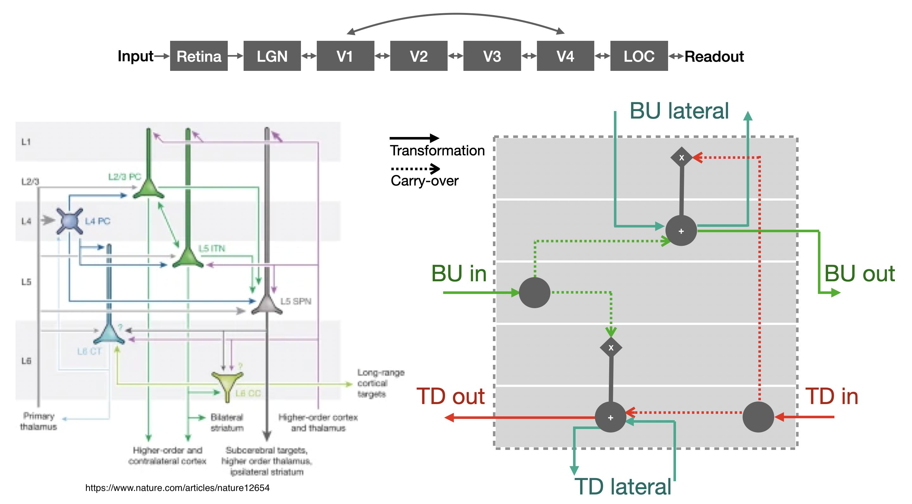

# BLT_VS Model

This repository contains the **BLT_VS** (Bottom-up Lateral Top-down - Ventral Stream) model, which simulates the ventral stream of the visual cortex, while taking into account, the columnar organisation of bottom-up and top-down information flows, and the RF sizes and neuron counts across visual areas (5 DVA image presentation). The model is designed for image classification tasks and can be loaded with pre-trained weights. 



More information about the architecture and the design choices can be found under [Network design](#network-design).

---

## Models shipped

- **Imagenet - non_bio_unroll - 6** (default): This model outputs 1000-way class logits over 6 timesteps. 
- **Ecoset - bio_unroll - 12**: This model output 565-way class logits over 8 timesteps where the information from input reaches readout.

These models are available through HuggingFace - https://huggingface.co/novelmartis/blt_vs_model - and are pulled from there for evaluation. 

---

## Installation and Example evaluation

1. **Create a new environment** named `blt_vs_env` and activate it:
  ```bash
  conda create --name blt_vs_env python=3.9
  conda activate blt_vs_env
  ```
2. **Install the dependencies**:
  ```bash
  conda install pytorch torchvision torchaudio pytorch-cuda=11.8 -c pytorch -c nvidia
  conda install numpy pillow
  pip install huggingface_hub
  ```
3. **Clone and install the BLT_VS package**:
  ```bash
  git clone https://github.com/KietzmannLab/BLT-VS
  cd BLT-VS
  pip install -e .
4. **Run example script**:
  ```bash
  python example.py
  ```
  This should download an image of a baby turtle and classify it at the final timestep of the BLT loaded. You can change 'dataset' from 'imagenet' to 'ecoset' to switch between the models.

---

## Network Design

### Info about design choices in BLT_VS:

- Retina -> LGN -> V1 -> V2 -> V3 -> V4 -> LOC -> Readout: kernel size and strides computed to match mean RF sizes for each ROI, assuming a 5deg image presentation for 224px images (additionally there's a provision for 128px in case you need a smaller network), channel size computed using #neurons comparison
- Avg. RF sizes (radii at 2.5deg): Retina: 0.18deg (Table 1, P-cells-surround https://www.sciencedirect.com/science/article/pii/0042698994E0066T), LGN: 0.4 (Fig.5 https://www.jneurosci.org/content/22/1/338.full), V1: 0.75, V2: 0.8, V3: 1.37, V4: 1.85, LOC: 2.48 (Fig. 4 https://www.jneurosci.org/content/jneuro/31/38/13604.full.pdf)
- Avg. #neurons: Retina: 300k, LGN: 450k, V1: 98M, V2: 68.6M, V3: 39.2M, V4: 19.6M, LOC: 39.2M (see txt below - extremely crude approximations using chatgpt-o1-preview). Now there's 4 kinds of pyramidal cells in cortical columns it seems (see Fig in Box 1 https://www.nature.com/articles/nature12654) so we divide the numbers by half as we only care about the bottom-up and top-down pathways. So scaling is [1,1,326,229,131,65,131] - too large so I'll use relative scale - based roughly on square root - [1,1,18,15,11,8,11]
- For lateral connections, see Fig.6 of https://www.jneurosci.org/content/22/19/8633.long - visual field multiplication factor of around 2.5 found in V1, corresponding to a particular cortical distance. This implies the magnification factor reduces as we go to higher RF regions - I'll just use ks of 5 here (3 for 128px). Using depthwise separable convolutions to reduce #params (spread kernel and then mix channels)
- For topdown connections, we will use the same kernel and stride info as bottom-up connections and then scale output during forward pass implicitly with transposed convolutions
- For the prereadout layer, the BU output is num_classes+100 dims with conv layer kernel_size 5 (3 for 128px), then avgpool + slice classes -> losses, while the conv output (relued) goes back to LOC via transposed conv - this ensures we maintain spatial info for TD connections; we add features to maintain orientation, color, and other such info.
- Skip connections info - only V4 receives skip connections from V1, and only V1 receives skip connections from V4; although all layers from V1 to V4 are connected with each other (https://academic.oup.com/cercor/article/1/1/1/408896?login=true), we only add these two long-range connection for simplicity here. They are also modeled as depthwise separable convolutions to save parameters. These connections ae additive to the bottom-up and top-down connections (https://www.jneurosci.org/content/13/9/3681.long).
- Connections to and from the pulvinar are not included - they potentially become important for attention and other such tasks, but for now, we'll keep it simple.
- The separate bottom-up and top-down streams, and multiplicative interactions (whoever is on distal dendrite is the multiplier), are inspired by cortical organisation, see Fig in Box 1 of https://www.nature.com/articles/nature12654. Lateral connections come and go in the same layers as BU and TD (https://www.jneurosci.org/content/3/5/1116.long) and they are additive as they latch onto proximal dendrites (https://onlinelibrary.wiley.com/doi/abs/10.1002/cne.903050303)

For a recent similar 2-stream network check out - https://www.biorxiv.org/content/10.1101/2024.09.09.612033v2

---------------------------------------------------

### Eff RFs and area sizes (224px):
- layer 0 - retina - RF size needed 8 - kernel size 7 - got RF 7 - stride 2 (eff stride 2, 112px)
- layer 1 - LGN - RF size needed 18 - kernel size 7 - got RF 19 - stride 2 (eff stride 4, 56px)
- layer 2 - V1 - RF size needed 34 - kernel size 5 - got RF 35 - stride 2 (eff stride 8, 28px)
- layer 3 - V2  - RF size 36 - kernel size 1 - got RF 35 (eff stride 8, 28px)
- layer 4 - V3 - RF size 61 - kernel size 5 - got RF 67 (eff stride 8, 28px)
- layer 5 - V4 - RF size 83 - kernel size 3 - got RF 83 (eff stride 8, 28px)
- layer 6 - LOC - RF size 93 - kernel size 3 - got RF 99 - stride 2 (eff stride 16, 14px)
- layer 7 - Readout - kernel size 5 - got RF 163 - stride 2 (eff stride 32, 7px) - 163/224 is good enough for good object-scale readout!

### Eff RFs and area sizes (128px):
- layer 0 - retina - RF size needed 5 - kernel size 5 - got RF 5 - stride 2 (eff stride 2, 64px)
- layer 1 - LGN - RF size needed 10 - kernel size 3 - got RF 9 - stride 2 (eff stride 4, 32px)
- layer 2 - V1 - RF size needed 19 - kernel size 3 - got RF 17 - stride 2 (eff stride 8, 16px)
- layer 3 - V2  - RF size 20 - kernel size 1 - got RF 17 (eff stride 8, 16px)
- layer 4 - V3 - RF size 35 - kernel size 3 - got RF 33 (eff stride 8, 16px)
- layer 5 - V4 - RF size 47 - kernel size 3 - got RF 49 (eff stride 8, 16px)
- layer 6 - LOC - RF size 63 - kernel size 3 - got RF 65 - stride 2 (eff stride 16, 8px)
- layer 7 - Readout - kernel size 3 - got RF 97 - stride 2 (eff stride 32, 4px) - 97/128 is good enough for good object-scale readout!

---------------------------------------------------

GPT o1-preview summary of Average Number of Pyramidal Neurons Dedicated to the Central 5 Degrees in Visual Processing Regions

Below is a summary of the estimated average number of pyramidal neurons (or equivalent projection neurons) dedicated to processing the central 5 degrees of the visual field in various regions of the human visual system. Similar considerations are applied to the LGN and retina, focusing on the primary carriers of visual information (e.g., P and M cells). Relevant references are provided for each region for further reading.

1. Retina

	•	Average Number of Ganglion Cells (P and M Cells): Approximately 300,000 retinal ganglion cells dedicated to the central 5 degrees.
	•	Explanation:
	•	The retina contains around 1 to 1.5 million retinal ganglion cells per eye.
	•	The central 5 degrees (foveal and parafoveal regions) have a high density of ganglion cells, particularly parvocellular (P) cells and magnocellular (M) cells, which carry visual information to the brain.
	•	References:
	•	Curcio, C. A., & Allen, K. A. (1990). “Topography of ganglion cells in human retina.” Journal of Comparative Neurology, 300(1), 5-25.
	•	Provides detailed mapping of ganglion cell distribution in the human retina.
	•	Dacey, D. M. (1993). “The mosaic of midget ganglion cells in the human retina.” Journal of Neuroscience, 13(12), 5334-5355.
	•	Discusses the distribution of P cells in the human retina.

2. Lateral Geniculate Nucleus (LGN)

	•	Average Number of Relay Neurons (P and M Layers): Approximately 450,000 relay neurons per hemisphere dedicated to the central 5 degrees.
	•	Explanation:
	•	The LGN contains around 1 to 1.5 million relay neurons per hemisphere.
	•	Due to cortical magnification, a significant proportion of relay neurons in the parvocellular and magnocellular layers process information from the central visual field.
	•	References:
	•	Peters, A., & Jones, E. G. (Eds.). (1985). Cerebral Cortex: Volume 3: Visual Cortex. Plenum Press.
	•	Provides detailed anatomical data on the LGN and neuron counts.
	•	Malpeli, J. G., & Baker, F. H. (1975). “The representation of the visual field in the lateral geniculate nucleus of Macaca mulatta.” Journal of Comparative Neurology, 161(4), 569-594.
	•	Although based on macaques, provides insight into LGN neuron distribution.

3. Primary Visual Cortex (V1)

	•	Average Number of Pyramidal Neurons: Approximately 98 million pyramidal neurons dedicated to the central 5 degrees.
	•	Explanation:
	•	V1 contains about 140 million neurons dedicated to the central 5 degrees.
	•	Pyramidal neurons constitute approximately 70% of cortical neurons.
	•	Therefore, 70% of 140 million equals 98 million pyramidal neurons.
	•	References:
	•	Leuba, G., & Kraftsik, R. (1994). “Changes in volume, surface estimate, three-dimensional shape and total number of neurons of the human primary visual cortex from midgestation until old age.” Anatomy and Embryology, 190(4), 351-366.
	•	Provides estimates of neuron numbers in human V1.
	•	Rockel, A. J., Hiorns, R. W., & Powell, T. P. S. (1980). “The basic uniformity in structure of the neocortex.” Brain, 103(2), 221-244.
	•	Discusses neuron densities and cortical structure.

4. Secondary Visual Cortex (V2)

	•	Average Number of Pyramidal Neurons: Approximately 68.6 million pyramidal neurons dedicated to the central 5 degrees.
	•	Explanation:
	•	V2 has about 98 million neurons dedicated to the central 5 degrees.
	•	70% of 98 million equals 68.6 million pyramidal neurons.
	•	References:
	•	Van Essen, D. C., & Maunsell, J. H. R. (1983). “Hierarchical organization and functional streams in the visual cortex.” Trends in Neurosciences, 6(9), 370-375.
	•	Explores the organization of visual cortical areas.
	•	Felleman, D. J., & Van Essen, D. C. (1991). “Distributed hierarchical processing in the primate cerebral cortex.” Cerebral Cortex, 1(1), 1-47.
	•	Provides data on neuron counts and connectivity.

5. Third Visual Cortex (V3)

	•	Average Number of Pyramidal Neurons: Approximately 39.2 million pyramidal neurons dedicated to the central 5 degrees.
	•	Explanation:
	•	V3 has about 56 million neurons dedicated to the central 5 degrees.
	•	70% of 56 million equals 39.2 million pyramidal neurons.
	•	References:
	•	Burkhalter, A., Felleman, D. J., Newsome, W. T., & Van Essen, D. C. (1986). “Anatomical and physiological asymmetries related to visual areas V3 and VP in macaque extrastriate cortex.” Vision Research, 26(1), 63-80.
	•	Discusses the structure and function of V3.
	•	Zeki, S. (2003). “Imaging art with the brain.” Perception, 32(Special Issue), 371-392.
	•	Provides insights into visual processing areas.

6. Fourth Visual Cortex (V4)

	•	Average Number of Pyramidal Neurons: Approximately 19.6 million pyramidal neurons dedicated to the central 5 degrees.
	•	Explanation:
	•	V4 has about 28 million neurons dedicated to the central 5 degrees.
	•	70% of 28 million equals 19.6 million pyramidal neurons.
	•	References:
	•	Zeki, S. (1978). “Uniformity and diversity of structure and function in rhesus monkey prestriate visual cortex.” Journal of Physiology, 277, 273-290.
	•	Examines V4’s role in color and form processing.
	•	Gallant, J. L., Shoup, R. E., & Mazer, J. A. (2000). “A human extrastriate area functionally homologous to macaque V4.” Neuron, 27(2), 227-235.
	•	Identifies and describes human V4 functionally similar to macaque V4.

7. Lateral Occipital Complex (LOC)

	•	Average Number of Pyramidal Neurons: Approximately 39.2 million pyramidal neurons dedicated to the central 5 degrees.
	•	Explanation:
	•	The LOC has about 56 million neurons dedicated to the central 5 degrees.
	•	70% of 56 million equals 39.2 million pyramidal neurons.
	•	References:
	•	Grill-Spector, K., Kourtzi, Z., & Kanwisher, N. (2001). “The lateral occipital complex and its role in object recognition.” Vision Research, 41(10-11), 1409-1422.
	•	Discusses the function and importance of the LOC.
	•	Malach, R., Reppas, J. B., Benson, R. R., et al. (1995). “Object-related activity revealed by functional magnetic resonance imaging in human occipital cortex.” Proceedings of the National Academy of Sciences, 92(18), 8135-8139.
	•	Provides functional imaging evidence of LOC involvement in object perception.

### Note on Estimates:

#### Estimation Basis:
- The neuron counts are approximate and based on available data.
- Pyramidal neurons are estimated to constitute about 70% of the total neuronal population in cortical areas.
#### Cortical Magnification:
- The central 5 degrees of the visual field are overrepresented in the visual cortex to support high-acuity vision.
#### Variability:
- Individual differences and methodological approaches may affect estimates.
#### Methodology:
- Estimates combine data from histological studies, neuroimaging, and comparative anatomy.

### Explanation of Neuron Count Adjustments:

#### Pyramidal Neurons in Cortex:
- Only pyramidal neurons (principal excitatory neurons) are counted, excluding interneurons.
#### Relay Neurons in LGN:
- Focus is on relay neurons (P and M cells) that carry visual information to the cortex.
#### Ganglion Cells in Retina:
- Counting retinal ganglion cells (P and M cells), which are the output neurons of the retina transmitting visual signals to the brain.

